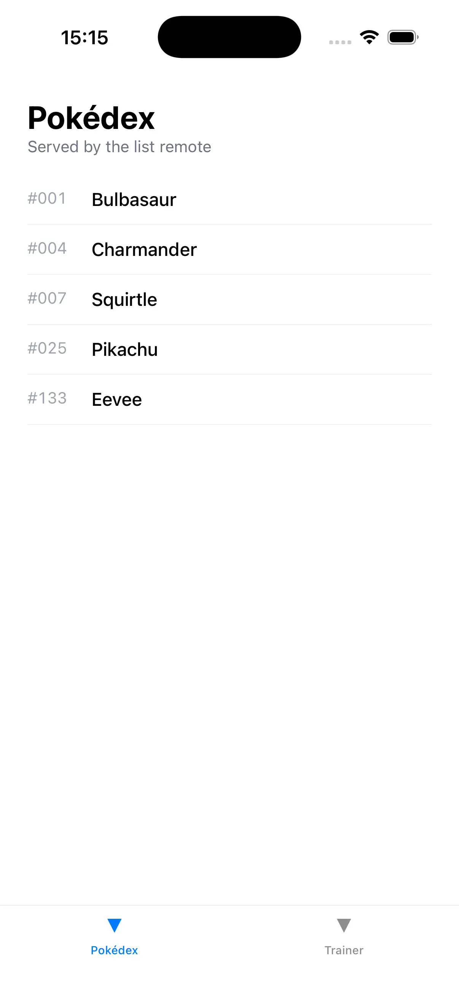
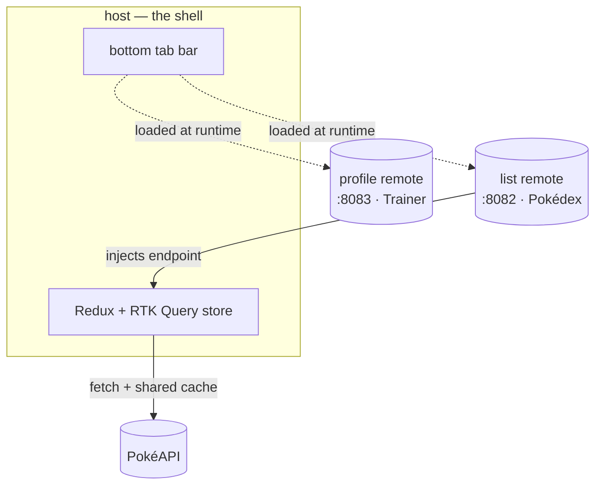

# React Native Module Federation

Companion code for the blog series **[React Native Module Federation](https://warrendeleon.com/blog/series/react-native-module-federation/)**. The series builds a federated React Native app from zero, one post at a time, with Re.Pack and Module Federation 2.0.

Each post has a matching git tag holding that post's finished state, so you can clone the repo, check out the tag for the post you're reading, and run exactly what the post builds.

<p align="center">
  
</p>

## Posts and tags

| Tag | Post | What it builds |
|---|---|---|
| [`post-02-first-remote`](https://github.com/warrendeleon/react-native-module-federation/tree/post-02-first-remote) | [Your first federated remote](https://warrendeleon.com/blog/your-first-federated-remote-react-native/) | A host that loads one screen from a separate remote app at runtime |
| [`post-03-shared-singleton`](https://github.com/warrendeleon/react-native-module-federation/tree/post-03-shared-singleton) | [The shared-singleton contract](https://warrendeleon.com/blog/shared-singleton-contract-react-native/) | Host and remote share a single copy of `react-native-safe-area-context`, so the remote reads the host's safe-area insets instead of bundling its own native module |
| [`post-04-host-shell`](https://github.com/warrendeleon/react-native-module-federation/tree/post-04-host-shell) | [The host shell: federated remotes as tabs](https://warrendeleon.com/blog/host-shell-federated-tabs-react-native/) | The host owns a bottom-tab navigator; each tab is a federated remote loaded at runtime — a Pokédex list and a Trainer profile |
| [`post-05-contracts`](https://github.com/warrendeleon/react-native-module-federation/tree/post-05-contracts) | [The contract package](https://warrendeleon.com/blog/typing-the-seam-between-remotes-react-native/) | A types-only contract published to a registry and installed by version, so the host and remotes agree on the seam; additive changes drift safely, breaking changes are caught by semver |
| [`post-06-shared-store`](https://github.com/warrendeleon/react-native-module-federation/tree/post-06-shared-store) | [One shared store: server state across remotes](https://warrendeleon.com/blog/one-shared-store-across-remotes-react-native/) | The host owns one Redux + RTK Query store; the list remote injects its endpoint into the shared `baseApi` and fills the cache with live PokéAPI data, validated with Zod at the seam. The host invalidates that cache across the module boundary by tag |

The first post, [*Why Module Federation in React Native*](https://warrendeleon.com/blog/why-module-federation-react-native/), is concept only and ships no code, so it has no tag. `main` tracks the latest post; more tags land as the series grows.

## Layout

At runtime, the host owns the tab bar and loads each remote from its own dev server:



The folders mirror that split:

```
apps/
├── host/      the shell app; owns navigation, loads remotes at runtime
├── list/      a federated remote; exposes the Pokédex screen
└── profile/   a federated remote; exposes the Trainer screen
```

## Quick start

Requirements: Node 22.11+ (see each app's `engines`), Xcode with an iOS simulator, Ruby + Bundler, CocoaPods.

```sh
git clone https://github.com/warrendeleon/react-native-module-federation
cd react-native-module-federation
# main is the latest post. To follow an earlier post, check out its tag first, e.g.
#   git checkout post-02-first-remote

# From post-05-contracts onward the apps depend on @pokedex/contracts
# (^2.0.0 from post-06-shared-store; it now ships the shared RTK Query api),
# which the root .npmrc resolves from a LOCAL Verdaccio registry. Publish it
# before installing, or npm install fails with ECONNREFUSED:
#   npx verdaccio &                                   # http://localhost:4873
#   npm adduser --registry http://localhost:4873/     # any user/pass/email
#   ( cd packages/contracts && npm install && npm run build && npm publish )

# install JS deps
( cd apps/list && npm install )
( cd apps/profile && npm install )
( cd apps/host && npm install )

# install iOS pods for the host
( cd apps/host/ios && bundle install && bundle exec pod install )
```

Then, in four terminals:

```sh
# 1. the list remote's dev server
cd apps/list && npm run start:remote      # :8082

# 2. the profile remote's dev server
cd apps/profile && npm run start:remote   # :8083

# 3. the host's dev server
cd apps/host && npm start                 # :8081

# 4. build and launch the host on a simulator
cd apps/host && npm run ios
```

The host boots into a bottom tab bar. Opening the **Pokédex** tab fetches the `list` remote from `:8082`; opening the **Trainer** tab fetches the `profile` remote from `:8083`. Each tab shows a spinner the first time while its remote downloads.
