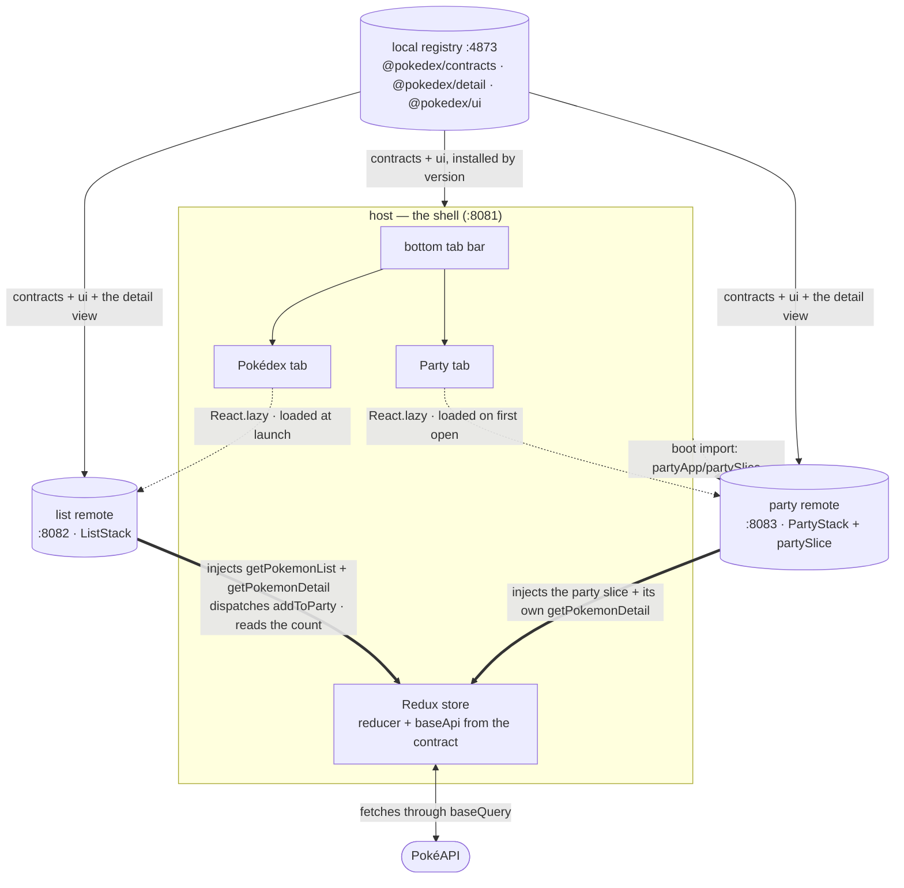

# React Native Module Federation

Companion code for the blog series **[React Native Module Federation](https://warrendeleon.com/blog/)**. The series builds a federated React Native app from zero, one post at a time, with Re.Pack and Module Federation 2.0.

Most posts have a matching git tag holding that post's finished state, so you can clone the repo, check out the tag for the post you're reading, and run exactly what the post builds. Tags exist where there is a build to run, so the essays carry a dash instead: post 1 opens the series and is not listed below, and post 7 sits in place with no tag of its own.

## Posts and tags

| Tag | Post | What it builds |
|---|---|---|
| `post-02-first-remote` | [Your first federated remote](https://warrendeleon.com/blog/your-first-federated-remote-react-native/?utm_source=github&utm_medium=readme&utm_campaign=module-federation-first-remote) | A host app that loads a screen from a separate remote app at runtime |
| `post-03-shared-singleton` | [The shared-singleton contract](https://warrendeleon.com/blog/shared-singleton-contract-react-native/?utm_source=github&utm_medium=readme&utm_campaign=module-federation-shared-singleton) | react, react-native and the safe-area library shared as singletons, so one copy serves every app |
| `post-04-host-shell` | [The host shell: federated remotes as tabs](https://warrendeleon.com/blog/host-shell-federated-tabs-react-native/?utm_source=github&utm_medium=readme&utm_campaign=module-federation-host-shell) | The host owns a bottom tab bar; a second remote fills the second tab, fetched the first time you open it |
| `post-05-contracts` | [The contract package](https://warrendeleon.com/blog/typing-the-seam-between-remotes-react-native/?utm_source=github&utm_medium=readme&utm_campaign=module-federation-contracts) | Each tab grows its own stack, the detail screen ships as a versioned package both stacks install, and a published contract types what they pass it |
| `post-06-shared-store` | [One shared store](https://warrendeleon.com/blog/one-shared-store-across-remotes-react-native/?utm_source=github&utm_medium=readme&utm_campaign=module-federation-shared-store) | The contract package exports one RTK Query instance; the host builds a store around it and the Pokédex domain injects its live PokéAPI endpoints into the one shared cache |
| — | [Who owns what](https://warrendeleon.com/blog/who-owns-what-federated-react-native/?utm_source=github&utm_medium=readme&utm_campaign=module-federation-ownership) | No code: the ownership essay behind posts 4 to 6, argued once as five tests for where a boundary, a component and a data definition belong |
| `post-08-client-state` | [Client state across the seam](https://warrendeleon.com/blog/client-state-across-federated-remotes-react-native/?utm_source=github&utm_medium=readme&utm_campaign=module-federation-client-state) | The party app injects its own slice into the shared store at runtime; the contract carries the one action that crosses; the detail view gains an optional Add button its consumers wire |
| `post-09-tanstack-zustand` | [State stacks under federation](https://warrendeleon.com/blog/state-stacks-under-federation-react-native/?utm_source=github&utm_medium=readme&utm_campaign=module-federation-state-stacks) | The same app rebuilt on TanStack Query and Zustand, a fork off the post-08 line rather than the next step on it, so this tag never folds into `main` |
| `post-10-two-backends` | [Two backends, one client?](https://warrendeleon.com/blog/rtk-query-vs-apollo-react-native/?utm_source=github&utm_medium=readme&utm_campaign=module-federation-rtk-query-apollo) | A GraphQL endpoint joins the REST one in the same api slice via queryFn; both provide the same tag, so the host's one Refresh press refetches both protocols |
| `post-11-design-system` | [The design system as a federated singleton](https://warrendeleon.com/blog/federated-design-system-react-native/?utm_source=github&utm_medium=readme&utm_campaign=module-federation-design-system) | @pokedex/ui: gluestack-ui copy-in primitives, the token palette and the composed components, shared as a host-provided singleton; the detail completes its design as 4.0.2; one host toggle re-themes every bundle |

`main` tracks the latest post. More tags land as the series grows.

## Dependency advisories

`npm audit fix` and the in-range bumps are applied at every tag: `@module-federation/enhanced` 2.9.0 and the `@react-native-community/cli` trio (core and both platform packages) at 20.2.0, validated by `scripts/federation-smoke.sh` and the full test suites. What remains is a single upstream advisory pair on `image-size`, and every finding at every tag traces to it. It is reached through Re.Pack throughout, through `@callstack/repack-plugin-nativewind` at `post-11`, and at `post-02` to `post-05` through React Native's own Metro as well: those trees resolve Metro 0.84.4, and 0.84.5 is not reachable in them without moving off React Native 0.85.3, which the series pins. That leaves five high findings per app up to `post-05`, two from `post-06`, and three at `post-11`, with none in `packages/detail`. npm still reports the Metro entries as fixable; `npm audit fix`, an explicit `npm update`, and `npm audit fix --force` all decline to move them. All of it is build-time tooling that runs on the developer's machine and ships nothing into the app bundle. The advisories cover every `image-size` 1.x release and Re.Pack pins `^1`, so the fix arrives with an upstream Re.Pack release rather than an override handing it an API it was not built against.

## Layout

```
apps/
├── host/     the shell app; owns the tab bar and loads the two stack remotes
├── list/     a federated remote; exposes the Pokédex stack
└── party/    a federated remote; exposes the Party stack
packages/
├── contracts/  @pokedex/contracts — the route params and module types, published to a registry
├── detail/     @pokedex/detail — the Pokémon detail view as a versioned component; presentational, fed by each consumer's own container
└── ui/         @pokedex/ui — the design system: gluestack-ui copy-in primitives, colour tokens and composed components, shared at runtime as a host-provided singleton
```

## Quick start

Requirements: Node 22.11+, Xcode with an iOS simulator, Ruby + Bundler, CocoaPods.

```sh
git clone https://github.com/warrendeleon/react-native-module-federation
cd react-native-module-federation
git checkout post-11-design-system
```

The apps install `@pokedex/contracts` from a local registry, so publish it before installing them. Leave the registry running in its own terminal:

```sh
npx verdaccio                                    # :4873, stays up
npm adduser --registry http://localhost:4873     # any username, password and email
( cd packages/contracts && npm install && npm run build && npm publish )
( cd packages/detail && npm install && npm run build && npm publish )
( cd packages/ui && npm install && npm run build && npm publish )
```

Then the apps:

```sh
( cd apps/list && npm install )
( cd apps/party && npm install )
( cd apps/host && npm install )

# install iOS pods for the host
( cd apps/host/ios && bundle install && bundle exec pod install )

# prove the federation builds: three Re.Pack bundles, both remote manifests, the host bundle
sh scripts/federation-smoke.sh
```

Then, in four terminals:

```sh
# 1. the list remote's dev server
cd apps/list && npm run start:remote      # :8082

# 2. the party remote's dev server
cd apps/party && npm run start:remote     # :8083

# 3. the host's dev server
cd apps/host && npm start                 # :8081

# 4. build and launch the host on a simulator
cd apps/host && npm run ios
```

The host boots on the Pokédex tab and fetches the `list` remote from `:8082`, which fills the shared store with the first 151 Pokémon from PokéAPI. Tap a row and the list's container fetches that Pokémon through the same store and feeds it to the view installed from `@pokedex/detail`, pushed inside the Pokédex tab so the tab bar stays on screen. Tap **Add to party** on a detail and the dispatch crosses the seam: the party app's slice — injected into the shared store at boot — catches it, the Pokédex header counter ticks, and the Party tab shows the member.

## Architecture


```mermaid
flowchart TD
    registry[("local registry :4873<br/>@pokedex/contracts · @pokedex/detail · @pokedex/ui")]
    pokeapi(["PokéAPI"])
    subgraph host["host — the shell (:8081)"]
        tabs["bottom tab bar"]
        store["Redux store<br/>reducer + baseApi from the contract"]
        t1["Pokédex tab"]
        t2["Party tab"]
        tabs --> t1
        tabs --> t2
    end
    list[("list remote<br/>:8082 · ListStack")]
    party[("party remote<br/>:8083 · PartyStack + partySlice")]
    t1 -.->|"React.lazy · loaded at launch"| list
    t2 -.->|"React.lazy · loaded on first open"| party
    host -.->|"boot import: partyApp/partySlice"| party
    list ==>|"injects getPokemonList + getPokemonDetail<br/>dispatches addToParty · reads the count"| store
    party ==>|"injects the party slice + its own getPokemonDetail"| store
    store <-->|"fetches through baseQuery"| pokeapi
    registry -->|"contracts + ui, installed by version"| host
    registry -->|"contracts + ui + the detail view"| list
    registry -->|"contracts + ui + the detail view"| party
```
