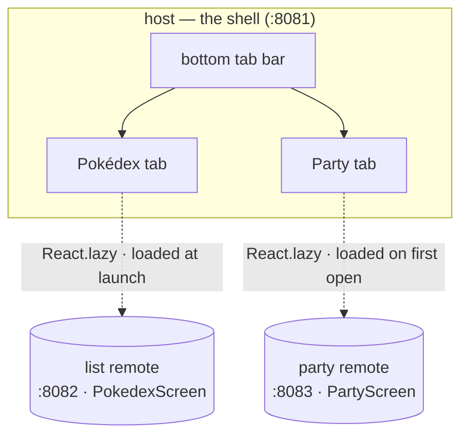

# React Native Module Federation

Companion code for the blog series **[React Native Module Federation](https://warrendeleon.com/blog/)**. The series builds a federated React Native app from zero, one post at a time, with Re.Pack and Module Federation 2.0.

Each post has a matching git tag holding that post's finished state, so you can clone the repo, check out the tag for the post you're reading, and run exactly what the post builds.

## Posts and tags

| Tag | Post | What it builds |
|---|---|---|
| `post-02-first-remote` | Your first federated remote | A host app that loads a screen from a separate remote app at runtime |
| `post-03-shared-singleton` | The shared-singleton contract | react, react-native and the safe-area library shared as singletons, so one copy serves every app |
| `post-04-host-shell` | The host shell: federated remotes as tabs | The host owns a bottom tab bar; a second remote fills the second tab, fetched the first time you open it |

`main` tracks the latest post. More tags land as the series grows.

## Layout

```
apps/
├── host/    the shell app; owns navigation and loads remotes at runtime
├── list/    a federated remote; exposes the Pokédex screen
└── party/   a federated remote; exposes the Party screen
```

## Quick start

Requirements: Node 22.11+, Xcode with an iOS simulator, Ruby + Bundler, CocoaPods.

```sh
git clone https://github.com/warrendeleon/react-native-module-federation
cd react-native-module-federation
git checkout post-04-host-shell

# install JS deps
( cd apps/list && npm install )
( cd apps/party && npm install )
( cd apps/host && npm install )

# install iOS pods for the host
( cd apps/host/ios && bundle install && bundle exec pod install )
```

Then, in four terminals:

```sh
# 1. the list remote's dev server
cd apps/list && npm run start:remote      # :8082

# 2. the party remote's dev server
cd apps/party && npm run start:remote     # :8083

# 3. the host's dev server
cd apps/host && npm start                 # :8081

# 4. build and launch the host on a simulator
cd apps/host && npm run ios
```

The host boots on the Pokédex tab and fetches the `list` remote from `:8082`. Open the Party tab and it fetches the `party` remote from `:8083` — the first request to that server happens on the first press, not at launch.

## Architecture


```mermaid
flowchart TD
    subgraph host["host — the shell (:8081)"]
        tabs["bottom tab bar"]
        t1["Pokédex tab"]
        t2["Party tab"]
        tabs --> t1
        tabs --> t2
    end
    list[("list remote<br/>:8082 · PokedexScreen")]
    party[("party remote<br/>:8083 · PartyScreen")]
    t1 -.->|"React.lazy · loaded at launch"| list
    t2 -.->|"React.lazy · loaded on first open"| party
```
