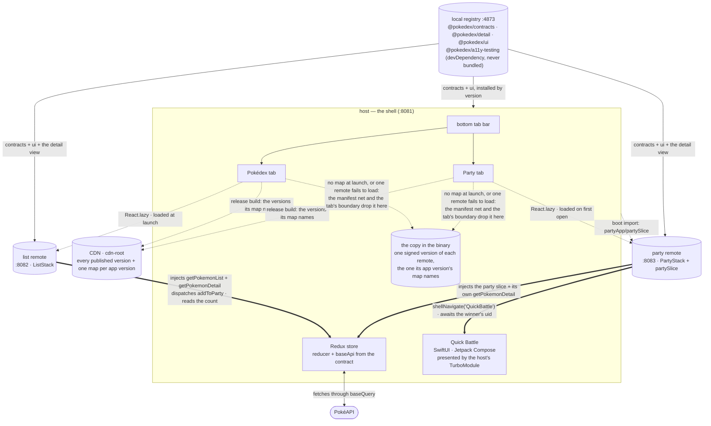

# React Native Module Federation

Companion code for the blog series **[React Native Module Federation](https://warrendeleon.com/blog/)**. The series builds a federated React Native app from zero, one post at a time, with Re.Pack and Module Federation 2.0.

Most posts have a matching git tag holding that post's finished state, so you can clone the repo, check out the tag for the post you're reading, and run exactly what the post builds. Tags exist where there is a build to run, so the essays carry a dash instead: post 1 opens the series and is not listed below, and post 7 sits in place with no tag of its own.

## Posts and tags

| Tag | Post | What it builds |
|---|---|---|
| `post-02-first-remote` | [Your first federated remote](https://warrendeleon.com/blog/your-first-federated-remote-react-native/?utm_source=github&utm_medium=readme&utm_campaign=module-federation-first-remote) | A host app that loads a screen from a separate remote app at runtime |
| `post-03-shared-singleton` | [The shared-singleton contract](https://warrendeleon.com/blog/shared-singleton-contract-react-native/?utm_source=github&utm_medium=readme&utm_campaign=module-federation-shared-singleton) | react, react-native and the safe-area library shared as singletons, so one copy serves every app |
| `post-04-host-shell` | [The host shell: federated remotes as tabs](https://warrendeleon.com/blog/host-shell-federated-tabs-react-native/?utm_source=github&utm_medium=readme&utm_campaign=module-federation-host-shell) | The host owns a bottom tab bar; a second remote fills the second tab, fetched the first time you open it |
| `post-05-contracts` | [The contract package](https://warrendeleon.com/blog/typing-the-seam-between-remotes-react-native/?utm_source=github&utm_medium=readme&utm_campaign=module-federation-contracts) | Each tab grows its own stack, the detail screen ships as a versioned package both stacks install, and a published contract types what they pass it |
| `post-06-shared-store` | [One shared store](https://warrendeleon.com/blog/one-shared-store-across-remotes-react-native/?utm_source=github&utm_medium=readme&utm_campaign=module-federation-shared-store) | The contract package exports one RTK Query instance; the host builds a store around it and the Pokédex domain injects its live PokéAPI endpoints into the one shared cache |
| — | [Who owns what](https://warrendeleon.com/blog/who-owns-what-federated-react-native/?utm_source=github&utm_medium=readme&utm_campaign=module-federation-ownership) | No code: the ownership essay behind posts 4 to 6, argued once as five tests for where a boundary, a component and a data definition belong |
| `post-08-client-state` | [Client state across the seam](https://warrendeleon.com/blog/client-state-across-federated-remotes-react-native/?utm_source=github&utm_medium=readme&utm_campaign=module-federation-client-state) | The party app injects its own slice into the shared store at runtime; the contract carries the one action that crosses; the detail view gains an optional Add button its consumers wire |
| `post-09-tanstack-zustand` | [State stacks under federation](https://warrendeleon.com/blog/state-stacks-under-federation-react-native/?utm_source=github&utm_medium=readme&utm_campaign=module-federation-state-stacks) | The same app rebuilt on TanStack Query and Zustand, a fork off the post-08 line rather than the next step on it, so this tag never folds into `main` |
| `post-10-two-backends` | [Two backends, one client?](https://warrendeleon.com/blog/rtk-query-vs-apollo-react-native/?utm_source=github&utm_medium=readme&utm_campaign=module-federation-rtk-query-apollo) | A GraphQL endpoint joins the REST one in the same api slice via queryFn; both provide the same tag, so the host's one Refresh press refetches both protocols |
| `post-11-design-system` | [The design system as a federated singleton](https://warrendeleon.com/blog/federated-design-system-react-native/?utm_source=github&utm_medium=readme&utm_campaign=module-federation-design-system) | @pokedex/ui: gluestack-ui copy-in primitives, the token palette and the composed components, shared as a host-provided singleton; the detail completes its design as 4.0.2; one host toggle re-themes every bundle |
| `post-12-a11y-testing` | [Accessibility testing across federated remotes](https://warrendeleon.com/blog/accessibility-testing-federated-remotes-react-native/?utm_source=github&utm_medium=readme&utm_campaign=module-federation-a11y-testing) | @pokedex/a11y-testing: one Jest preset, WCAG helpers and a report, installed by both source packages and both remotes; the token matrix checks contrast at the design system, each team checks its own screens against the same bar, and the touch targets and status regions it found ship as ui 1.0.12 and detail 4.0.11, and the host takes the ui release alongside both remotes |
| `post-13-native-handoff` | [shell.navigateTo: native screens from a federated remote](https://warrendeleon.com/blog/native-handoff-federated-remotes-react-native/?utm_source=github&utm_medium=readme&utm_campaign=module-federation-native-handoff) | contracts 3.3.0 carries one routing table and one promise-returning `shellNavigate`; the host adds a TurboModule and presents a fully native Quick Battle in SwiftUI and Compose; the winner's uid comes back through the promise and lands in the party's own state, crossing no contract action |
| `post-14-production-build` | [The production build and the three modes](https://warrendeleon.com/blog/production-build-three-modes-react-native/?utm_source=github&utm_medium=readme&utm_campaign=module-federation-production-build) | Both remotes built for production and signed chunk by chunk, laid out as the directory a content delivery network serves; one environment variable moves the host between the dev servers and that CDN, and the release build of each platform runs with no dev server at all |
| `post-15-cdn-flip` | [CDN delivery: the version map, the resolver, and the live flip](https://warrendeleon.com/blog/cdn-version-resolution-react-native/?utm_source=github&utm_medium=readme&utm_campaign=module-federation-cdn-flip) | The CDN holds every published version of each remote; each released app version gets a map saying which of them it may load; the host fetches its own map at launch and resolves every chunk to a versioned, signature-verified URL. Then a new remote version reaches an installed app through one uploaded directory and one edited line, and is rolled back the same way |
| `post-16-fallbacks` | [Fallback for federated remotes: the copy in the binary and the net in the session](https://warrendeleon.com/blog/offline-fallback-federated-remotes-react-native/?utm_source=github&utm_medium=readme&utm_campaign=module-federation-fallbacks) | Every release build carries a signed copy of both remotes. With the CDN out of reach at launch the app runs from those copies; mid-session, a remote that fails to load drops to its own copy while the other stays on the CDN. A tab that still fails shows its error state, and Try again loads the remote again rather than replaying the failure |

`main` tracks the latest post. More tags land as the series grows.

## Dependency advisories

`npm audit fix` and the in-range bumps are applied at every tag: `@module-federation/enhanced` 2.9.0 and the `@react-native-community/cli` trio (core and both platform packages) at 20.2.0, validated by `scripts/federation-smoke.sh` and the full test suites. What remains is a single upstream advisory pair on `image-size`, and every finding at every tag traces to it. It is reached through Re.Pack throughout, through `@callstack/repack-plugin-nativewind` and `@callstack/repack-plugin-reanimated` from `post-11`, and at `post-02` to `post-05` through React Native's own Metro as well: those trees resolve Metro 0.84.4, and 0.84.5 is not reachable in them without moving off React Native 0.85.3, which the series pins. That leaves five high findings per app up to `post-05`, two from `post-06`, and four at `post-11` and `post-12`, where Re.Pack's NativeWind and Reanimated plugins each add a path to the same advisory. None of the four `packages/` workspaces reports any. npm still reports the Metro entries as fixable; `npm audit fix`, an explicit `npm update`, and `npm audit fix --force` all decline to move them. All of it is build-time tooling that runs on the developer's machine and ships nothing into the app bundle. The advisories cover every `image-size` 1.x release and Re.Pack pins `^1`, so the fix arrives with an upstream Re.Pack release rather than an override handing it an API it was not built against.

## Layout

```
apps/
├── host/     the shell app; owns the tab bar and loads the two stack remotes
├── list/     a federated remote; exposes the Pokédex stack
└── party/    a federated remote; exposes the Party stack
tools/
├── gen-signing-keys.mjs  generates the RSA keypair that signs production chunks, and writes the public half into the host's native config (keys stay out of git)
├── gen-signing-keys.test.mjs  the generator's regression tests: node --test tools/gen-signing-keys.test.mjs
└── build-cdn.mjs         builds every published version of both remotes into cdn-root/, writes one version map per released app version, and stages the copy each release build carries in embed-root/
packages/
├── a11y-testing/ the shared accessibility bar: Jest preset, WCAG helpers, report (devDependency only, never bundled)
├── contracts/  @pokedex/contracts — the route params and module types, published to a registry
├── detail/     @pokedex/detail — the Pokémon detail view as a versioned component; presentational, fed by each consumer's own container
└── ui/         @pokedex/ui — the design system: gluestack-ui copy-in primitives, colour tokens and composed components, shared at runtime as a host-provided singleton
```

## Quick start

Requirements: Node 22.11+, Xcode with an iOS simulator, Ruby + Bundler, CocoaPods.

```sh
git clone https://github.com/warrendeleon/react-native-module-federation
cd react-native-module-federation
git checkout post-16-fallbacks
```

The apps install four `@pokedex` packages from a local registry, so publish them before installing anything. Leave the registry running in its own terminal:

```sh
npx verdaccio                                    # :4873, stays up
npm adduser --registry http://localhost:4873     # any username, password and email
npm config set @pokedex:registry http://localhost:4873/
```

That third line matters more than it looks. npm reads project config from the directory holding
`package.json`, so the `.npmrc` at this repo's root is invisible to every `( cd packages/… && npm
install )` below it, and `npm adduser` writes an auth token rather than a scope mapping. Without
the scope set for your user, each `@pokedex` install goes to the public registry and 404s.

Publish in dependency order. Each package's own `npm install` resolves the `@pokedex` packages
it depends on, so a package has to be on the registry before the one that needs it runs:
`a11y-testing` is a devDependency of `ui` and `detail`, and `ui` is a peer of `detail`.

```sh
( cd packages/contracts && npm install && npm run build && npm publish )
( cd packages/a11y-testing && npm install && npm run build && npm publish )
( cd packages/ui && npm install && npm run build && npm publish )
( cd packages/detail && npm install && npm run build && npm publish )
```

Then the apps:

```sh
( cd apps/list && npm install )
( cd apps/party && npm install )
( cd apps/host && npm install )

# install iOS pods for the host
( cd apps/host/ios && bundle install && bundle exec pod install )

# prove the federation builds: three Re.Pack bundles, both remote manifests, the host bundle
sh scripts/federation-smoke.sh
```

Then, in four terminals:

```sh
# 1. the list remote's dev server
cd apps/list && npm run start:remote      # :8082

# 2. the party remote's dev server
cd apps/party && npm run start:remote     # :8083

# 3. the host's dev server
cd apps/host && npm start                 # :8081

# 4. build and launch the host on a simulator
cd apps/host && npm run ios
```

The host boots on the Pokédex tab and fetches the `list` remote from `:8082`, which fills the shared store with the first 151 Pokémon from PokéAPI. Tap a row and the list's container fetches that Pokémon through the same store and feeds it to the view installed from `@pokedex/detail`, pushed inside the Pokédex tab so the tab bar stays on screen. Tap **Add to party** on a detail and the dispatch crosses the seam: the party app's slice — injected into the shared store at boot — catches it, the Pokédex header counter ticks, and the Party tab shows the member. With two or more members, **Quick Battle** on the Party tab hands the party to a fully native screen the host presents, and the winner's uid comes back through one promise into the party's own state.

### Running the remotes from a CDN instead

The same app, with the remotes' dev servers switched off. Build them for production, serve the
result as static files, and point the host at it:

```sh
node tools/gen-signing-keys.mjs                    # once: the signing key, and its public half
node tools/build-cdn.mjs ios                       # or android, or omit for both
npx http-server@14.1.1 cdn-root -p 8000 -c-1 --cors       # leave it running
```

The first command writes the keypair that signs every production chunk and copies the public half
into `ios/Host/Info.plist` and `android/app/src/main/res/values/strings.xml`, which is where the
host's verifier reads it from. The second builds every published version of both remotes and
writes one version map per released app version:

```
cdn-root/ios/listApp/1.0.0/      cdn-root/ios/maps/1.0.0/version-map.json
cdn-root/ios/listApp/1.1.0/      cdn-root/ios/maps/2.0.0/version-map.json
cdn-root/ios/listApp/1.2.0/
cdn-root/ios/partyApp/1.0.0/
```

Then, in two terminals:

```sh
# 1. the host's dev server, told where the remotes live and which binary this is
cd apps/host && MF_CDN_BASE=http://localhost:8000 MF_APP_VERSION=2.0.0 npm start

# 2. build and launch the host
cd apps/host && npm run ios
```

At launch the app fetches `maps/2.0.0/version-map.json`, and loads exactly the versions that file
names. The banner above the tab bar says which mode the launch resolved to and which versions it
got; the chip in the Pokédex header says which build of the list remote is on screen.

Build it as `MF_APP_VERSION=1.0.0` instead and the same source produces a binary that asks a
different question and is handed listApp 1.0.0. Two app versions, one CDN, different code — which
is the whole reason the map is per app version.

A release build works the same way, with everything baked in at build time rather than read from a
running dev server:

```sh
cd apps/host && MF_CDN_BASE=http://localhost:8000 MF_APP_VERSION=2.0.0 npm run ios -- --mode Release
cd apps/host && MF_CDN_BASE=http://10.0.2.2:8000 MF_APP_VERSION=2.0.0 npm run android -- --mode release
```

An Android emulator reaches the machine at `10.0.2.2` rather than `localhost`, and a release
build only talks to either over plain http because `res/xml/network_security_config.xml` permits
those two addresses and nothing else.

### Shipping a remote version without a new binary

Two steps, in this order, against the tree the server is already serving. Build the version and
put its directory on the CDN first:

```sh
( cd apps/list && MF_REMOTE_VERSION=1.3.0 npm run bundle:ios:prod )
rsync -a --exclude '*.map' --exclude mf-stats.json apps/list/cdn/ios/listApp/1.3.0/ cdn-root/ios/listApp/1.3.0/
```

Nothing has changed for anybody yet: the directory is there and no map points at it. Then edit one
line of `cdn-root/ios/maps/2.0.0/version-map.json`:

```json
{
  "listApp": "1.3.0",
  "partyApp": "1.0.0"
}
```

Relaunch the installed app and it loads the new version. The map is the commit, which is why it is
written last: a map pointing at a directory that is not there yet is a 404 for every user who
launches in between. What they get is the copy of that remote their binary carries (see
[When the CDN is not there](#when-the-cdn-is-not-there)): a working tab, but the version the binary
shipped with, not the one being released. Rolling back is the same edit in reverse, and it needs no
build at all, because the old version's directory was never removed.

`tools/build-cdn.mjs` seeds a CDN rather than operating one. Running it again rebuilds the whole
tree from the lists at the top of the file, so it is the wrong tool for adding one version's
directory or editing a map.

### When the CDN is not there

`tools/build-cdn.mjs` also prepares the copy a release build carries: the version of each remote
that its app version's map names, its signed bundles and its manifest, staged in `embed-root/`,
with the versions recorded in `apps/host/src/shell/embedded-versions.ts`. The last build phase of
the iOS target and a Gradle task on Android copy `embed-root/` into the binary byte for byte, so
every bundle keeps the signature it is verified against. Run it before the release build; without
`embed-root/` both builds warn, succeed, and carry nothing.

```sh
node tools/build-cdn.mjs ios
cd apps/host && MF_CDN_BASE=http://localhost:8000 MF_APP_VERSION=2.0.0 npm run ios -- --mode Release
```

Stop the server, check that `curl http://localhost:8000/ios/maps/2.0.0/version-map.json` now
fails, and cold-start the app: the banner turns purple and reads `bundled`, and both tabs open
from the copies. Start the server again, move `cdn-root/ios/listApp/1.2.0` out of `cdn-root`, and
cold-start once more: the list's manifest is a 404, so that one remote runs from its copy and the
banner reads `cdn · listApp 1.2.0 embedded · partyApp 1.0.0`, while the party still loads from the
CDN. Move the directory back afterwards.

On iOS a copy needs a release build: a development build loads its own bundle from the dev server,
so there is no app directory to read a copy from. A development build with no CDN configured stays
on the dev servers on both platforms.

## Architecture


```mermaid
flowchart TD
    registry[("local registry :4873<br/>@pokedex/contracts · @pokedex/detail · @pokedex/ui<br/>@pokedex/a11y-testing (devDependency, never bundled)")]
    pokeapi(["PokéAPI"])
    subgraph host["host — the shell (:8081)"]
        tabs["bottom tab bar"]
        store["Redux store<br/>reducer + baseApi from the contract"]
        t1["Pokédex tab"]
        t2["Party tab"]
        native["Quick Battle<br/>SwiftUI · Jetpack Compose<br/>presented by the host's TurboModule"]
        copies[("the copy in the binary<br/>one signed version of each remote,<br/>the one its app version's map names")]
        tabs --> t1
        tabs --> t2
    end
    cdn[("CDN · cdn-root<br/>every published version + one map per app version")]
    list[("list remote<br/>:8082 · ListStack")]
    party[("party remote<br/>:8083 · PartyStack + partySlice")]
    t1 -.->|"React.lazy · loaded at launch"| list
    t2 -.->|"React.lazy · loaded on first open"| party
    host -.->|"boot import: partyApp/partySlice"| party
    list ==>|"injects getPokemonList + getPokemonDetail<br/>dispatches addToParty · reads the count"| store
    party ==>|"injects the party slice + its own getPokemonDetail"| store
    store <-->|"fetches through baseQuery"| pokeapi
    registry -->|"contracts + ui, installed by version"| host
    registry -->|"contracts + ui + the detail view"| list
    registry -->|"contracts + ui + the detail view"| party
    party ==>|"shellNavigate('QuickBattle') · awaits the winner's uid"| native
    t1 & t2 -.->|"release build: the versions its map names"| cdn
    t1 & t2 -.->|"no map at launch, or one remote fails to load:<br/>the manifest net and the tab's boundary drop it here"| copies
```
